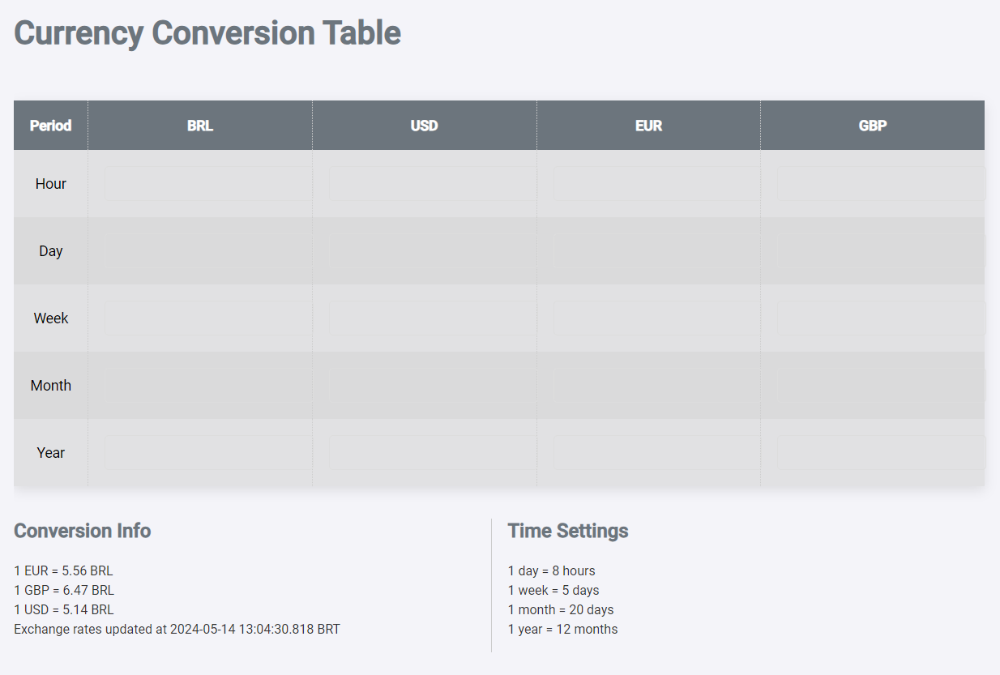

# Currency Conversion Table

This project provides a currency conversion table that allows users to input salaries in different currencies and time periods (hour, day, week, month, year) and automatically calculate conversions. The application uses current exchange rates and includes a responsive design for various screen sizes.

## Features

- Convert salaries across multiple currencies (BRL, USD, EUR, GBP)
- Calculate conversions for different time periods (hour, day, week, month, year)
- Automatically update all related values when any input is modified
- Responsive design for desktop and mobile views

## Usage

To use the Currency Conversion Table, simply open the application in your browser. You can input values into any of the text boxes, and the corresponding values in other currencies and time periods will be automatically calculated and displayed.

### Conversion Rates

The conversion rates are fetched from the Brazilian Central Bank's API and are updated to reflect the latest available data.

## Contributing

Contributions are welcome! Please open an issue or submit a pull request for any improvements or bug fixes.

## Privacy Policy

We use cookies and similar technologies, including those from third parties like Google, for the following purposes:

### Purposes Requiring Consent
- **Store and/or access information on a device**: Storing and accessing cookies and similar identifiers.
- **Create profiles for personalised advertising**: Creating profiles to show personalized ads.
- **Use profiles to select personalised advertising**: Using profiles to select personalized ads.
- **Create profiles to personalise content**: Creating profiles to personalize content.
- **Use profiles to select personalised content**: Using profiles to select personalized content.

### Purposes Based on Legitimate Interest
- **Use limited data to select advertising**: Showing relevant ads based on limited data.
- **Measure advertising performance**: Evaluating the effectiveness of advertising campaigns.
- **Measure content performance**: Evaluating the effectiveness of content displayed.
- **Develop and improve services**: Improving services based on user interaction.
- **Use limited data to select content**: Showing relevant content based on limited data.

For more information, please refer to our [Privacy Policy](https://jonathas.net/privacy-policy.html).

## Contact

For any questions or feedback, please contact Jonathas Costa at jonathas@example.com.
