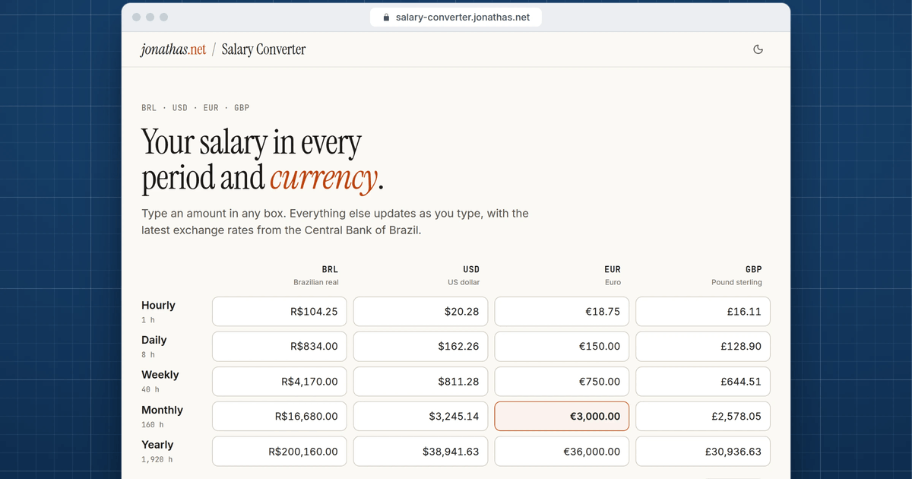

# Salary Converter

Converts a salary between hourly, daily, weekly, monthly and yearly pay, in Brazilian reais, US dollars, euros and pounds: **[salary-converter.jonathas.net](https://salary-converter.jonathas.net/)**.



- Type an amount in any box: every other period and currency updates as you type. Amounts can be typed in any style, such as `3000`, `3,000.50`, `3.000,50` or `R$ 3.000`, and are shown in your own locale's format.
- Exchange rates are the latest PTAX selling rates from the [Central Bank of Brazil](https://www.bcb.gov.br/en/financialstability/exchangerates), cached for an hour. If the Central Bank can't be reached, the last rates are used; with none at all, amounts still convert between periods.
- Working time is adjustable: hours per day, days per week, days per month and months per year. Set months per year to 14 for Portugal's 14 salaries, or 13.33 for Brazil's 13th salary and holiday bonus.
- The address always holds the amount and settings on screen, so any link reproduces the same table. **Copy link** (or **Share** on phones) sends it.
- Your last amount and settings are kept in your browser for the next visit.
- Works on phones, with a keyboard and with screen readers. Light and dark themes are shared with [jonathas.net](https://www.jonathas.net/).

## Development

It needs Node.js 22.12 or later.

```sh
npm install
npm run dev      # http://localhost:5173
npm test         # parsing, periods, conversion, rates, link and storage tests (Vitest)
npm run build    # type-checks, then builds to dist/
npm run preview  # serves dist/
```

It's TypeScript with no framework:

| Path                  | What it holds                                                                  |
| --------------------- | ------------------------------------------------------------------------------ |
| `src/lib/money.ts`    | Currencies, and reading and formatting amounts in any locale                   |
| `src/lib/periods.ts`  | Periods and working time (and reading the settings saved by the first version) |
| `src/lib/convert.ts`  | The conversion itself                                                          |
| `src/lib/rates.ts`    | Fetching PTAX rates from the Central Bank's API, and caching them              |
| `src/lib/url-state.ts`| Reading and writing the shareable link                                         |
| `src/ui/ads.ts`       | Google AdSense units                                                           |
| `src/main.ts`         | The table, the settings and the share button                                   |

## Ads and privacy

The page shows two Google AdSense units: one after the table, and one in a side column on wide screens. Each unit is only created and requested once its slot is on screen with a width. Space is kept for it while it loads, and given back when there is no ad or an ad blocker stops the script. Anywhere but the live domain, units are requested with `data-adtest="on"`, so testing doesn't count impressions.

Consent in the EEA, the UK and Switzerland is handled by Google's consent message, which is set up in AdSense under **Privacy & messaging**. [`privacy-policy.html`](privacy-policy.html) explains what the site stores and how AdSense uses cookies.

## Deployment

GitHub Actions tests and builds every push, and deploys `main` to GitHub Pages (`.github/workflows/deploy.yml`). In the repository settings, under **Pages**, the source must be **GitHub Actions**. `public/CNAME` keeps the custom domain.
